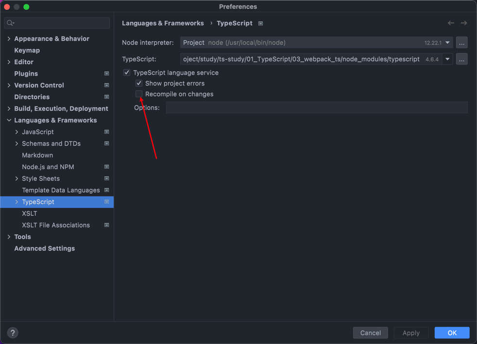

# Vue3、TS 基础学习

### 课程来源 
```
哔哩哔哩 尚硅谷Vue.JS教程快速入门到项目实战（Vue3/VueJS技术详解）
```

## 01_TypeScript

### 01_ts的第一次
```
当前目录下控制台执行命令：tsc [ts文件路径]，将ts文件编译为js文件，在 html 中引用js文件
```

### 02_ts在IDE中自动编译
```
Webstorm
preferences -- Languages&Frameworks -- TypeScript -- 勾选Recompile on changes

```

### 03_webpack_ts
```
依赖问题
html-webpack-plugin 从 5 换到 4，因为 webpack 版本为 4
ts-loader 从 9 换到 8
```

## 02_Vue3

### vue3_study
### vite_study
